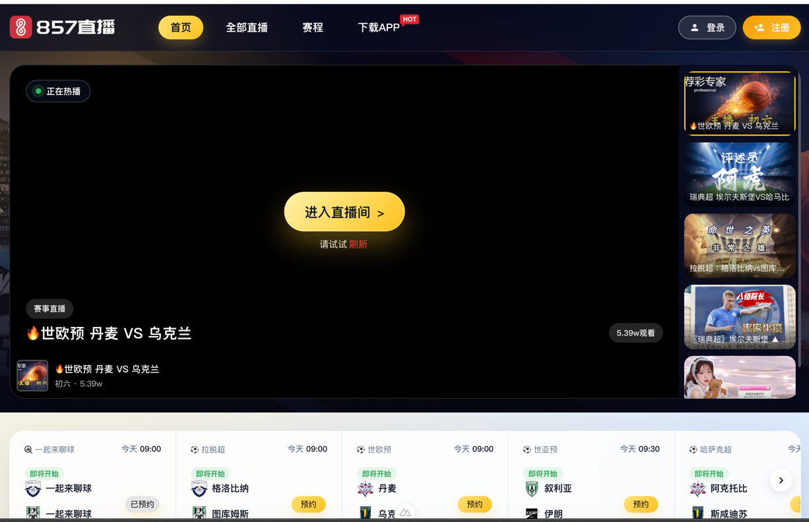

# 857直播仿站

基于 Nuxt 4 + Vue 3 实现的 857 直播首页仿制项目。

## 项目结构

```
857zb92/
├── app/
│   ├── components/        # 可复用 Vue 组件
│   │   ├── Carousel.vue     # 通用横向轮播
│   │   ├── LiveCard.vue     # 通用直播卡片
│   │   ├── Icon.vue         # SVG 图标组件
│   │   ├── FormInput.vue    # 表单输入框
│   │   ├── SocialLogin.vue  # 第三方登录
│   │   ├── HotAnchors.vue   # 热门主播轮播
│   │   ├── AppointmentList.vue  # 赛程预约轮播
│   │   ├── LiveCategory.vue     # 分类直播列表
│   │   ├── HotLives.vue         # 热门直播卡片
│   │   ├── HeroSection.vue      # 主视觉直播区
│   │   ├── LoginModal.vue       # 登录/注册弹窗
│   │   ├── SiteHeader.vue       # 顶部导航
│   │   ├── SiteFooter.vue       # 页脚
│   │   └── RightFix.vue         # 右侧固定工具栏
│   ├── layouts/           # 页面布局
│   ├── pages/             # 页面路由
│   └── app.vue            # 应用入口
├── public/                # 静态资源
├── nuxt.config.ts         # Nuxt 配置
├── package.json
├── LICENSE                # 开源协议
└── README.md
```

## 页面模块

- 顶部透明导航栏（滚动后变白）
- 主视觉直播区（大 Banner + 右侧直播列表）
- 热门直播卡片
- 热门主播轮播
- 分类直播列表（足球、篮球、其他）
- 右侧固定工具栏（返回顶部、下载 APP、意见反馈）
- 登录 / 注册弹窗
- 深色页脚

## 给项目点 Star

如果觉得这个项目对你有帮助，欢迎点击仓库右上角的 **Star ⭐** 按钮支持一下！

> 点 Star 不会收到任何通知，但可以帮助作者获得反馈，也能让更多人发现这个仓库。

## 启动

```bash
pnpm install
pnpm dev
```

本地预览地址：`http://localhost:3000`

## 页面预览



## 静态构建

本项目使用 `nuxt generate` 输出纯静态文件，部署时只需上传 `.output/public` 目录。

```bash
pnpm generate
```

构建产物目录：`.output/public`

如需本地预览静态站点：

```bash
pnpm preview
```

## 压缩与混淆

项目已内置以下优化配置，仅在 `pnpm generate` 生产构建时生效：

| 功能 | 依赖 | 说明 |
|------|------|------|
| JS 混淆 | `vite-plugin-javascript-obfuscator` | 对 `app/` 下的 `.vue` / `.ts` 进行代码混淆 |
| CSS 压缩 | `cssnano` + `autoprefixer` | 压缩 CSS 并自动补全浏览器前缀 |
| 资源压缩 | `vite-plugin-compression2` | 生成 `.gz` 与 `.br` 压缩文件 |

配置入口：`nuxt.config.ts`。

如需调整混淆强度，可修改 `vite.plugins.obfuscatorPlugin.options` 中的 [javascript-obfuscator 选项](https://github.com/javascript-obfuscator/javascript-obfuscator#options)。

## 协议

本项目采用 [MIT License](LICENSE) 开源。使用、修改或分发本项目时，必须保留原作者版权声明和许可声明。

Copyright (c) 2026 kboy <kosbox101@gmail.com>
