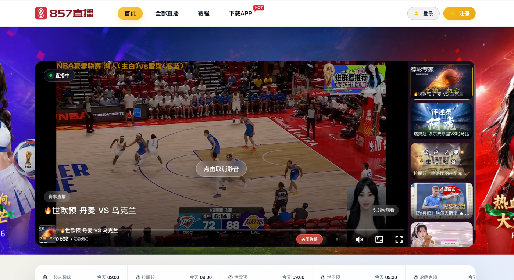
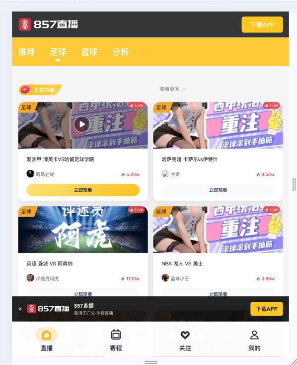

# 857 Live Clone

A clone of the 857 Live sports streaming platform built with Nuxt 4 + Vue 3.

## Project Structure

```
857zb92/
├── app/
│   ├── components/                # Vue components (by domain)
│   │   ├── layout/                # SiteHeader, Footer, Mobile*, RightFix…
│   │   ├── home/                  # Hero, HotLives, HotAnchors…
│   │   ├── common/                # Carousel, LiveCard, Empty*, DesktopOnly…
│   │   ├── icon/ · auth/ · player/
│   │   ├── room/ · user/ · match/ · news/ · download/ · recharge/
│   ├── composables/               # Auto-imported (nested dirs scanned)
│   │   ├── auth/                  # useAuth, useLoginModal
│   │   ├── i18n/                  # useI18n
│   │   ├── player/                # useXgPlayer
│   │   └── room/                  # useRoomGifts
│   ├── data/                      # Mock / static page data
│   ├── layouts/                   # default · catalog · blank
│   ├── locales/                   # zh-CN · en-US
│   ├── pages/                     # Routes
│   ├── assets/css/
│   │   ├── base/                  # tailwind, view-transitions, player-danmu
│   │   └── pages/                 # home, room, user, match…
│   └── app.vue
├── public/assets/                 # Static media (by type)
│   ├── logos/ · icons/ · brand/ · ui/
│   ├── avatars/ · banners/ · media/
│   └── covers/ · anchors/ · teams/
├── server/api/proxy/              # Stream proxy
├── design/screenshots/            # Local design dumps (gitignored)
├── nuxt.config.ts
├── package.json
├── tailwind.config.js
├── tsconfig.json
├── LICENSE
└── README.md
```

## Page Modules

- Transparent top navbar (turns solid on scroll)
- Hero live area (large banner + side live list)
- Popular live cards
- Popular anchors carousel
- Categorized live list (football, basketball, others)
- Right-side fixed toolbar (back to top, download app, feedback)
- Login / register modal
- Mobile bottom navigation bar (live, schedule, follow, profile)
- Mobile follow panel
- User dropdown menu with quick links
- Dark footer
- User center page

## User Center

The user center page is implemented in `app/pages/user.html.vue`. It supports the following sections and features:

- Sidebar navigation with active state management
- Profile card with avatar, level, assets, and quick links
- **我的资料** (My Profile):
  - 基本资料 (Basic info)
  - 修改头像 (Change avatar with local preview)
  - 修改昵称 (Change nickname with 5-30 char rule)
  - 实名认证 (Real-name authentication)
  - 绑定手机 (Bind phone with countdown verification)
- **我的消息** (Messages)
- **我的财富** (My Wealth) with dynamic table headers for:
  - 鹅肝消费记录
  - 鹅蛋记录
  - 装备包使用记录
  - 门票消费
  - 卡券明细
- **我的关注** (Followed streamers)
- **视频订单** (Video orders)
- **观看历史** (Watch history)
- **赛事预约** (Match appointments)
- **我的趣猜** (My guesses)
- **我的奖牌** (Medals)
- **我的投稿** (Contributions)
- **视频收藏** (Video collections)
- **房间管理** (Room management)
- **上传视频** (Upload video) with format/size validation
- **我的视频空间** (My video space) with stats and sortable tabs
- Apply for live streaming shortcut that jumps to real-name authentication

Navigation and conditional rendering use English keys (`activeMenu`, `activeTab`, `activeWealthTab`) for consistency, while UI labels remain in Chinese.

## Additional Modules

Beyond the homepage and user center, the project also includes:

- **Live Room** (`app/pages/room/[id].vue`)
  - Video player via `XgPlayer` component
  - Live schedule / match info tabs
  - Interactive gift and chat toolbar
  - `RoomImChat.vue` IM chat panel with fake messages and quick-send buttons
  - Mobile room layout with tabs for video, schedule, and chat
- **Recharge** (`app/pages/recharge.html.vue`)
  - Recharge amount selection and payment method tabs
  - Recharge record table
- **News** (`app/pages/news.html.vue`)
  - News list and detail layout
- **Match Detail** (`app/pages/match.html.vue`)
  - Match statistics, lineups, and live text commentary
- **Icon Components**
  - `IconLiver.vue` / `IconEgg.vue` for user asset indicators
  - `IconFollow.vue` for the user menu follow item
  - `IconHistory.vue` for watch history
- **Shared UI**
  - `EmptyTableRow.vue` for empty table states
  - `WatchHistoryPanel.vue` for the watch history grid with live status badges
  - `RoomImChat.vue` for chat panels
- **State Management**
  - `useAuth.js` for login state
  - `useLoginModal.js` for global login modal control
  - `useXgPlayer.js` for video player lifecycle

## Give a Star

If this project helps you, feel free to click the **Star ⭐** button in the top-right corner of the repository!

> Starring does not trigger any notifications, but it helps the author get feedback and makes the repository more discoverable.

## Getting Started

```bash
pnpm install
pnpm dev
```

Local preview: `http://localhost:3000`

## Page Preview





## Page Transitions

The project enables Nuxt View Transitions and a fade in/out fallback:

- `experimental.viewTransition: true` in `nuxt.config.ts`
- `app.pageTransition: { name: 'page', mode: 'out-in' }` in `nuxt.config.ts`
- `app/assets/css/view-transitions.css` handles the old page fade-out, new page fade-in, and shared cover transitions for live rooms

Internal navigation must use Nuxt client-side routing, e.g. `NuxtLink`, `navigateTo()`, or `router.push()`. Do not use plain `<a href="/...">` for internal links, otherwise it triggers a full page reload and View Transitions / fade animations will not work.

External links, download links, and backup URLs can still use normal `<a>` with `target="_blank"`.

## Static Build

This project uses `nuxt build` to generate static files. Upload the `dist` folder for deployment.

```bash
pnpm build
```

Build output directory: `dist`

For a fast build (skip JS obfuscation and Gzip/Brotli compression):

```bash
pnpm build:fast
```

To preview the static site locally:

```bash
pnpm preview
```

## Compression & Obfuscation

The following optimizations are built in and enabled by default for production builds (`pnpm build`):

| Feature | Dependency | Description |
|------|------|------|
| JS obfuscation | `vite-plugin-javascript-obfuscator` | Obfuscates `.vue` / `.ts` files under `app/` |
| CSS compression | `cssnano` + `autoprefixer` | Minifies CSS and adds vendor prefixes |
| Asset compression | `vite-plugin-compression2` | Generates `.gz` and `.br` files |

Config entry: `nuxt.config.ts`.

To adjust obfuscation strength, modify `vite.plugins.obfuscatorPlugin.options` in [javascript-obfuscator options](https://github.com/javascript-obfuscator/javascript-obfuscator#options).

## Internationalization (i18n)

The project uses a lightweight custom lazy-loaded i18n setup:

- Locale files are split under `app/locales/` (`zh-CN.js`, `en-US.js`)
- `app/composables/useI18n.js` exposes `useI18n()` with `t(key)`, `locale`, and `loadLocale()`
- Browser language is detected on the client; `zh*` maps to `zh-CN`, `en*` maps to `en-US`, and all other languages fall back to `zh-CN`
- Only the selected locale chunk is loaded at runtime via `import.meta.glob('../locales/*.js')`

Main UI strings in navigation, mobile sticky bar, mobile follow panel, header, login modal, live/match/room pages, and LiveCard use this composable. Mock sports/team/anchor/chat data remains hardcoded Chinese unless explicitly requested.

## License

This project is open source under the [MIT License](LICENSE). You must retain the original copyright notice and license when using, modifying, or distributing this project.

Copyright (c) 2026 kboy <kosbox101@gmail.com>
